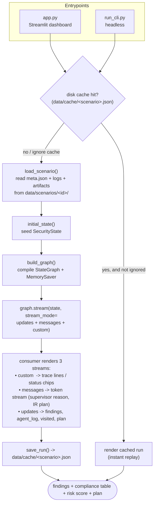
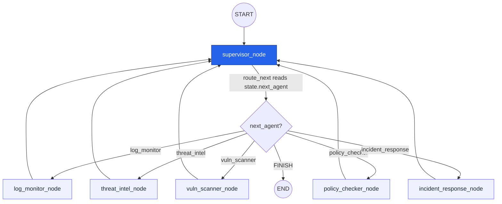
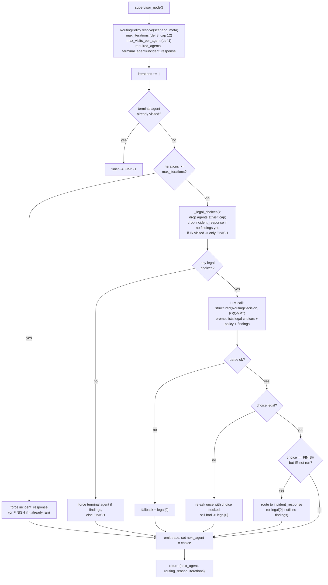
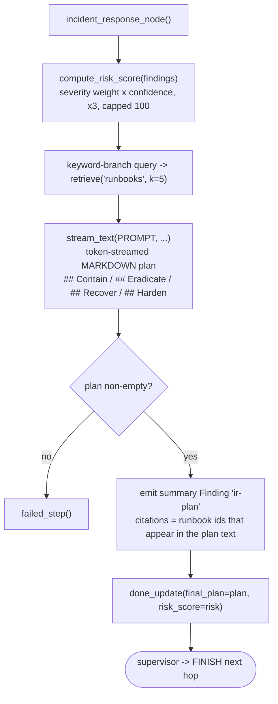
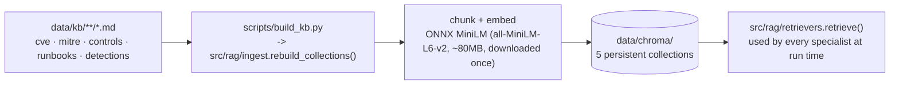
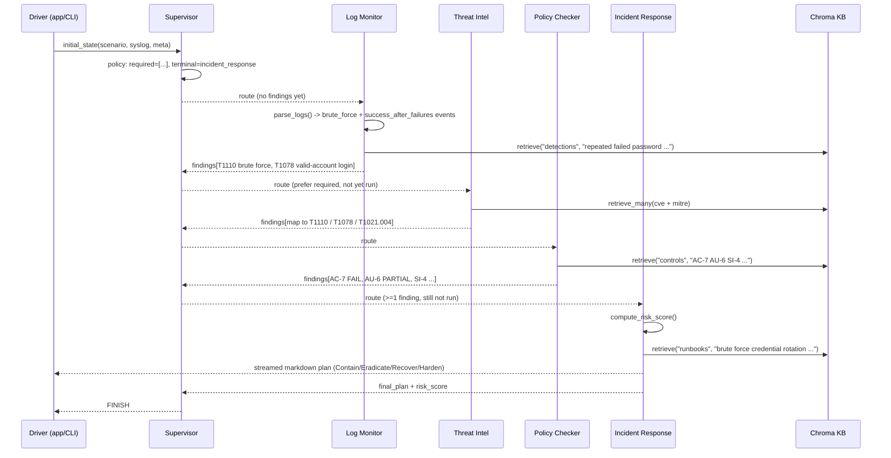

# How the Cybersecurity Multi-Agent SOC Works

A supervisor-orchestrated LangGraph. One **supervisor** node routes to five
**specialist** nodes over a local Chroma RAG knowledge base. Every specialist
runs the same shape: deterministic pre-step → RAG retrieve → one LLM call →
citation filter. Results accumulate in a shared `SecurityState`. The run ends
when `incident_response` has produced a phased remediation plan.

---

## 1. Entry points and the run lifecycle

Key files: `app.py` / `run_cli.py` (drivers), `src/scenarios.py` (loader),
`src/cache.py` (disk replay), `src/graph.py` (graph assembly).

---

## 2. The supervisor loop (the LangGraph)

- Wiring is a **hub-and-spoke**: `START → supervisor`, a conditional edge from
  `supervisor` to any specialist or `END`, and every specialist has a fixed
  edge back to `supervisor` (`src/graph.py:30-50`).
- State fields `findings`, `agent_log`, `visited` are `Annotated[..., operator.add]`
  reducers, so each specialist's return is **appended**, not overwritten
  (`src/state.py:64-77`).
- `MemorySaver` checkpointer keyed by `thread_id = scenario_id`.

---

## 3. How the supervisor decides (code-enforced policy, then LLM)

The LLM never gets the final say — code narrows the choice to a legal set first,
and overrides an illegal or premature pick.

Source: `src/supervisor.py` — `RoutingPolicy.resolve` (23-62),
`_legal_choices` (96-108), `supervisor_node` (111-198), `route_next` (201-207).
Guarantees: `incident_response` runs only after ≥1 finding, runs **last**, each
specialist runs at most `max_visits_per_agent` times, and the run is bounded by
`max_iterations`.

---

## 4. Inside a specialist node (shared shape)

All of `log_monitor`, `threat_intel`, `vuln_scanner`, `policy_checker` follow
`src/agents/common.py`. `incident_response` is a variant that streams markdown
instead of parsing JSON.

```mermaid
flowchart LR
    IN["SecurityState<br/>(raw_logs, artifacts, findings so far)"] --> PRE

    subgraph PRE["1. Deterministic pre-step (no LLM)"]
        direction TB
        p1["log_monitor: parse_logs() regex -> ParsedEvent[]"]
        p2["threat_intel: regex-extract CVE ids + IP IOCs from prior findings"]
        p3["vuln_scanner: scan_artifacts() + match_cves() vs local CVE table"]
        p4["policy_checker: bucket prior findings into categories"]
    end

    PRE --> QRY["2. Build a query string<br/>(keyword-branch: log4shell/jndi vs brute-force)"]
    QRY --> RET["3. retrieve() / retrieve_many()<br/>Chroma similarity search on one/more collections<br/>-> (text, chunk_id, score) triples"]
    RET --> LLM["4. run_llm_findings():<br/>structured(FindingBatch, PROMPT, context=retrieved)<br/>one LLM call, JSON parsed from text + 1 repair retry"]
    LLM --> SAN["5. sanitize_findings():<br/>assign id + agent, clamp confidence,<br/>DROP any citation not in retrieved chunk ids"]
    SAN --> OUT["return done_update():<br/>findings[] , visited=[agent] , agent_log=[step]"]

    OUT --> BACK(["back to supervisor"])
```

- **Retrieval is scoped per collection**: `cve`, `mitre`, `controls`,
  `runbooks`, `detections` (`src/config.py:20`). Each agent queries the
  collection(s) relevant to its job.
- **Citations can't be hallucinated**: `sanitize_findings` keeps only chunk ids
  that were actually retrieved (`src/agents/common.py:37-58`), and
  `--check` / the UI re-resolve every id against Chroma via `resolve_chunk`.
- **Model-agnostic structured output**: `src/llm.py` renders Pydantic format
  instructions into the prompt, extracts the outermost `{...}` from the reply,
  validates, and does exactly one repair round-trip on failure. No tool-calling,
  no `response_format` on the demo path.

---

## 5. Incident Response node (terminal)

Source: `src/agents/incident_response.py`.

---

## 6. Knowledge base build (offline, one-time)

`--smoke` asserts `CVE-2021-44228` is a top hit for "log4j jndi rce" and a
brute-force rule is a top hit for "repeated failed password".

---

## 7. End-to-end example: `ssh_bruteforce` scenario

(`vuln_scanner` is the analogous required agent on the `log4shell` scenario,
where it flags `log4j-core@2.14.1` from `requirements.txt` / the `Dockerfile`.)

---

## State object passed between every node

| Field | Written by | Reducer | Purpose |
|---|---|---|---|
| `raw_logs`, `artifacts`, `scenario_meta` | `initial_state` | replace | scenario inputs |
| `findings` | every specialist | **append** | citation-backed findings list |
| `agent_log` | every specialist | **append** | per-step status + latency + retrieved ids (trace) |
| `visited` | every specialist | **append** | drives visit-cap + terminal-agent policy |
| `next_agent`, `routing_reason`, `iterations` | supervisor | replace | routing decision for `route_next` |
| `final_plan`, `risk_score` | `incident_response` | replace | terminal output |

Defined in `src/state.py:64-77`.
